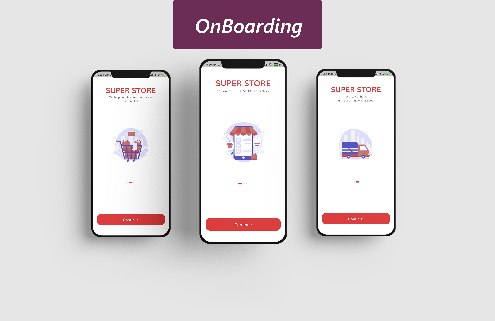
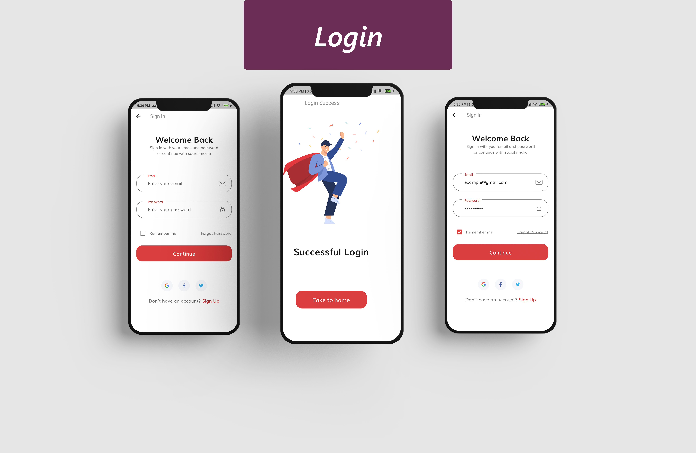
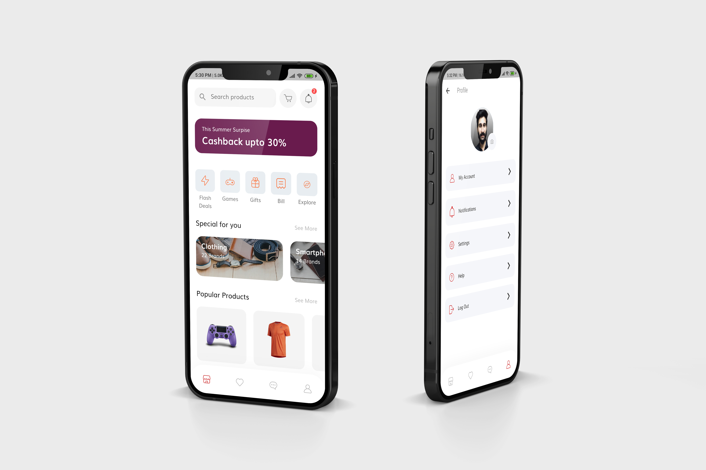

# Flutter-Ecommerce-App - Flutter UI 

This e-commerce app can run both Andriod and iOS devices because it builds with flutter framework with best coding practices.

## [Watch it on YouTube](https://youtube.com/playlist?list=PLxUBb2A_UUy8OlaNZpS2mfL8xpHcnd_Af)

<!-- **Packages we are using:**

- flutter_svg: [link](https://pub.dev/packages/flutter_svg)

### Video Preview of Final UI

 -->

## Screens it contains:

* Onboarding

* Login

* Forgot Password

* Sign Up

* Home Page

* Product Details

* Profile

* Bottom Navigation Bar

 Thanks for your love and support 🙏 

## Photos

